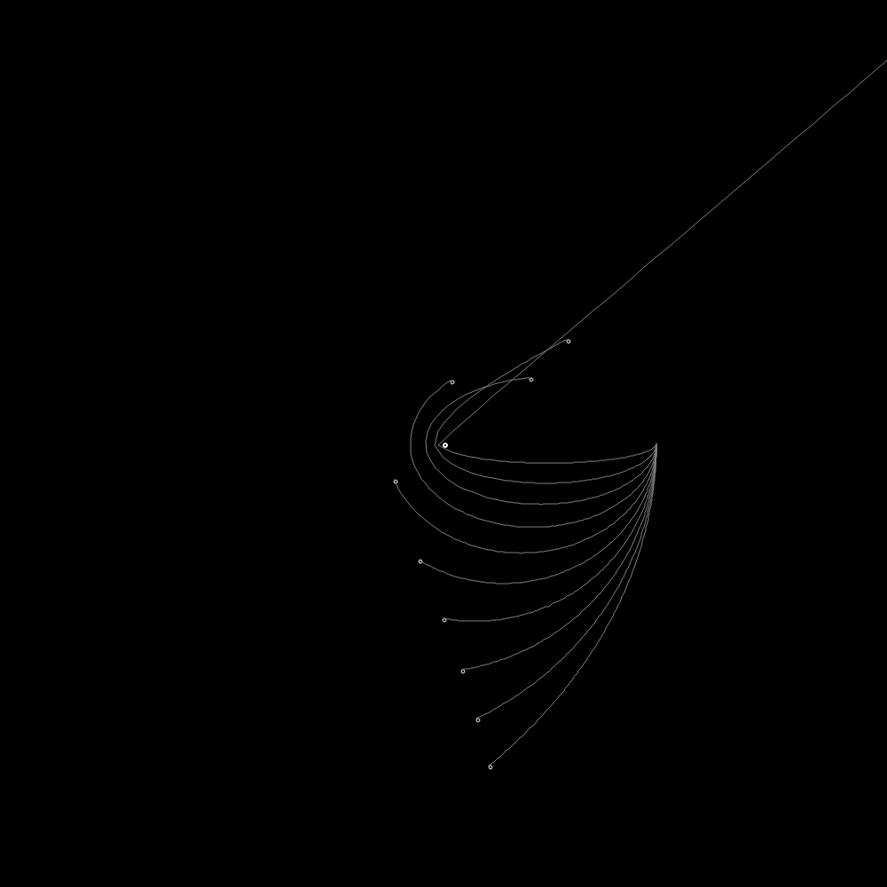

## Physics Simulation Framework

This Python project serves as a versatile framework for simulating various physics problems and phenomena using a graphical user interface (GUI) built with PyQt5. It provides a foundation for modeling and visualizing different physics simulations and can be extended to accommodate new scenarios and simulations.

### Galería de Imágenes


*Descripción de la imagen 1*


*Descripción de la imagen 2*

### Project Overview

The project includes several key components:

#### PhysicsObject Class

This class defines the properties and behavior of physics objects. You can customize attributes like name, mass, position, velocity, diameter, color, shape, and trajectories.

#### PhysicsSystem Class

Represents a physics system and contains a list of physics objects. It provides methods for simulating the behavior of objects within the system based on relevant physics principles.

#### Specific System Classes

Subclasses of PhysicsSystem (e.g., SolarSystem, ParticleSystem, WaveSimulation) define specific physics scenarios, such as celestial motion, particle interactions, or wave propagation.

#### MainWindow Class (WDW)

Implements the primary graphical user interface for displaying and interacting with physics simulations. Users can switch between different simulations, start/stop animations, save simulation data, and export images.

### Getting Started

To run the project and explore different physics simulations, follow these steps:

1. Install PyQt5: If you haven't already, install the PyQt5 library using pip:

   ```bash
   pip install PyQt5
